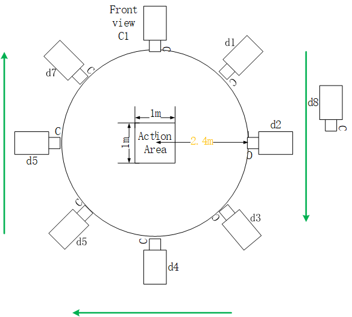
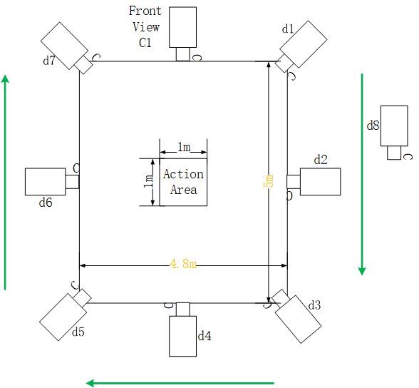
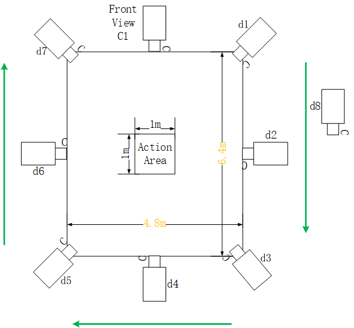

# UESTC RGB-D Action Database
UESTC RGB-D Action Database contains 40 categories of aerobic exercise. We utilized 2 Kinect V2 cameras in 8 fixed directions and 1 round direction to capture these actions with the data modalities of RGB video, 3D skeleton sequences and depth map sequences. 

The camera1 is fixed in the front view and we move the camera2 to 8 different directions. We record three kinds of data from Kinect V2, Skeleton, RGB Video and Depth Image at 30 Hz. The subjects perform 3 repetitions of each action in a fixed direction while perform each action until the capture finished in the round direction. Prior to each recording, the subjects are given instructions on how actions to perform, however no specific details about performance style or speed are given to subjects.

****

## 1.	Data capture settings
There are 40 different subjects to demonstrate each action and each action is simultaneously captured by camera1 and camera2. To enrich our dataset, we adopt three kinds of capture scenarios with different shapes and sizes. Figure 1, 2, and 3 illustrate the layout of cameras and 9 different views of the capture configurations. When the subjects perform actions, they always face front view camera1.
### 1.1	The first type of scenario

<b>Fig.1 The first data capture configurations</b>

There are ten actions NO.0-NO.9 & persons NO.01-NO.40 collected with this type of scenario.

### 1.2	The second type of scenario

<b>Fig.2 The second data capture configurations</b>

The table2 in appendix is persons’ IDs and their actions captured with the second scenario.

### 1.3	The third type of scenario

<b>Fig 3. The third data capture configurations</b>

The rest of actions NO.10-NO.39 and persons are captured with the third type of scenario. The detailed description of these actions and persons’ IDs could be found in appendix table3.
In this type of capture scenario, 15 actions are collected by sitting and standing posture, the other 15 actions are only collected by standing posture. With * mark means the action collected by sitting in appendix table3. The ratio of persons that takes sitting posture to standing posture are 1:1 in 15 actions using sitting and standing.

### 1.4	The naming rules of files 
<table>
  <tr>
    <th>Items</th>
    <th>Action categories</th>
    <th>View</th>
    <th>Person</th>
    <th>Front/side view</th>
  </tr>
  <tr>
    <td>For short</td>
    <td>a x</td>
    <td>d x</td>
    <td>p xxx</td>
    <td>c x</td>
  </tr>
  <tr>
    <td>Range</td>
    <td>0~39</td>
    <td>1~7,8</td>
    <td>001~118</td>
    <td>1~2</td>
  </tr>
  <tr>
    <td>Description</td>
    <td>The definition of 40 actions is listed in appendix Table 1.</td>
    <td>1~7: the fixed views
    8: the varying view
    As Fig.1 shows, the front view is annotated with c1.
    </td>
    <td>Person ID</td>
    <td>1: the front view, denote as c1 
		2: the side view and varying view, denote as c2.
	</td>
  </tr>
</table>

For example：
<table border="2" bordercolor="black" width="500" cellspacing="0" cellpadding="5">  
        <tr>  
            <td  rowspan="4"><b>a0_d1_p01_c1</b></td>  
            <td><b>a0</b>: action of punching and knee lifting.</td>  
            <td></td>  
        </tr>  
        <tr>  
            <!--<td>2.1</td>-->  
            <td><b>d1</b>: view 1 </td>  
            <td></td>  
        </tr>  
        <tr>  
            <!--<td>3.1</td>-->  
            <td><b>p01</b>: person ID is 01.</td>  
            <td></td>  
        </tr>  
        <tr>  
            <!--<td>3.1</td>-->  
            <td><b>c1</b>: the data is captured in the front view, and keep synchronized with the sequence of a0_d1_p01_c2.</td>  
            <td></td>  
        </tr>  
</table>  

<table border="2" bordercolor="black" width="500" cellspacing="0" cellpadding="5">  
        <tr>  
            <td  rowspan="4"><b>a0_d1_p01_c2</b></td>  
            <td><b>a0</b>: action of punching and knee lifting.</td>  
            <td></td>  
        </tr>  
        <tr>  
            <!--<td>2.1</td>-->  
            <td><b>d1</b>: view 1 </td>  
            <td></td>  
        </tr>  
        <tr>  
            <!--<td>3.1</td>-->  
            <td><b>p01</b>: person ID is 01.</td>  
            <td></td>  
        </tr>  
        <tr>  
            <!--<td>3.1</td>-->  
            <td><b>c1</b>: the data is captured in the view1 (side view), and keep synchronized with the sequence of a0_d1_p01_c1.</td>  
            <td></td>  
        </tr>  
</table>  

*****

## 2	Data Modalities

**Note**: In some actions, when we collect side views ax_d1_px_c2, ax_d2_px_c2 and ax_d3_px_c2 data with camera2, we also use camera3 to collect side views ax_d7_px_c2, ax_d6_px_c2 and ax_d5_px_c2 data, at the same time, the data collected from camera1 are named as ax_d1_px_c1, ax_d2_px_c1 and ax_d3_px_c1. Which means, for each action, except for varying view, there are 7 side view data named ax_dm_px_c2 (m: 1 to 7) and 4 front view data named ax_dn_px_c1 (n: 1 to 4). To keep the integrity of this dataset, we copy data named ax_d1_px_c1, ax_d2_px_c1 and ax_d2_px_c1 to ax_d7_px_c1, ax_d6_px_c1 and ax_d5_px_c1. But the depth files are too big to process, so we made a name map for Depth Data and can be found in ‘namemap.xls’. 

The first column in the ‘namemap.xls’ presents the true name of all files but some of them do not existed, the second column presents the corresponding existent files that you should find, the third column presents whether files are the same as their true names.

### 2.1  Color AVI (25600files 81.2GB)
Color videos are in the “RGBvideo/ax_dx_px_cx_color.avi” directory with the video format “.avi” and each frame resolution is 960*540（CV_8UC3, and video frames are synchronized with the Joint Skeleton Frame）.The approximate lengths of each recording in the fixed view and round view are 6 sec and 57 sec.

### 2.2	Skeleton TXT (25600files 11.7GB)
The skeleton txt are in the “skeleton/ax_dx_px_cx_skeleton.txt” directory with file format of “.txt”. We utilize Kinect V2 cameras to record 25 body joints’ coordinates in one frame, each file contains all skeleton frames in one sample. Each skeleton frame is comprised of 76 lines content in txt file.

* **First line** is “#”, “#” is a notation for the start of one joint frame.
* <b>The 2nd to 76th lines</b> are 25 joints of one frame (3D camera space coordinates, color frame point, and depth frame point). 
	- 3D camera space point ends with “0”(unit is m).
	- Color frame point ends with “1”. (unit is pixel)
	- Depth frame point ends with “2”. (unit is pixel)

And we provide the Matlab script for skeleton data read, named “skl_features_extract.m”. 

### 2.3	Depth Folder (21509files 1.34TB)
Depth data is in the “depth/ax_cx_dx_px_depth.tar” directory. These depth images are saved in the format of “.png” with the resolution of 512*424. Depth pixels are saved to unit16 bits.
According to the Kinect SDK document, the high 13-bits in the depth data represent the real value of the depth while the low 3-bits is encoded with user-ID to distinguish the different users. Moreover, the measurement range of the depth acquisition is from 0.5 meter to 4.5 meter with the high precision of 1 millimeter. 

### 2.4	Skeleton MAT (25600files 5.5GB)
Skeleton mats are in the “mat_from_skeleton/ax_dx_px_cx_skeleton.mat” directory. The mats are extracted from skeleton txt files. In one mat file, each row contains one skeleton frame (25 joints) and these joints are described in camera space coordinate.

****

## What's more

Please refer to the file `Appendix.pdf` for more detail about the action categories both in English and Chinese. If you have any question about this database including wishing to evalute your algorithm on this database, feel free to contact us with e-mail [yanliji@uestc.edu.cn](yanliji@uestc.edu.cn).

